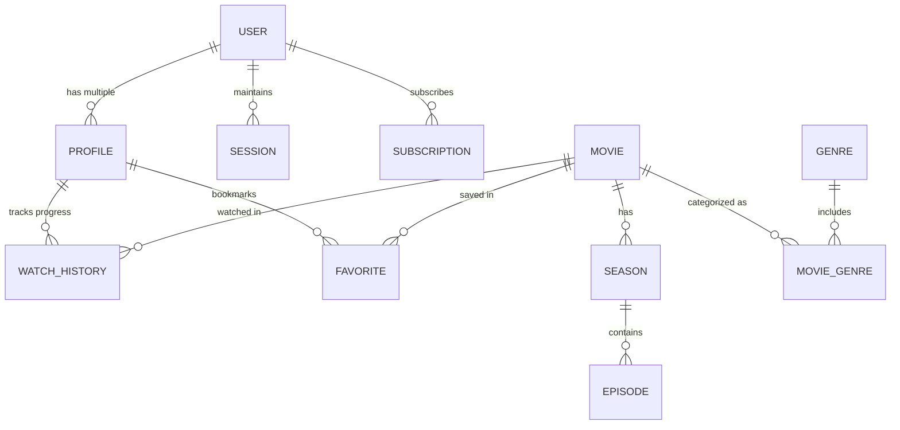
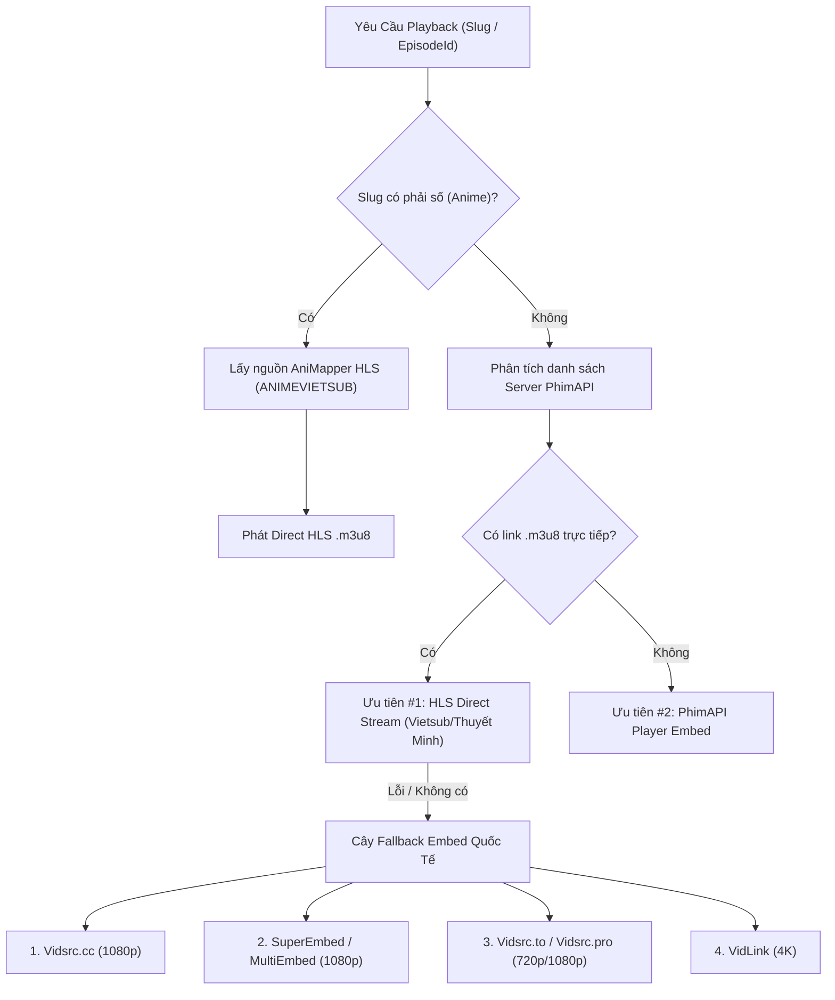

# StreamForge (RytoxGroup) — Master Project Blueprint & Zero-to-One Rebuild Guide

> **Phiên bản:** 2.0.0 (Enterprise Architecture Edition)  
> **Phương pháp tiếp cận:** System Audit + Reverse Engineering + Zero-to-One Rebuild Roadmap  
> **Mục tiêu:** Cung cấp bản đặc tả kỹ thuật và cẩm nang tái thiết lập toàn diện hệ thống Web Xem Phim Streaming cao cấp (Full-stack Monorepo) từ con số 0.

---

## MỤC LỤC

1. [PHẦN 1: SYSTEM AUDIT (KIỂM TOÁN HỆ THỐNG TOÀN DIỆN)](#phần-1-system-audit-kiểm-toán-hệ-thống-toàn-diện)
   - [1.1. Kiến trúc Monorepo & Phân rã Workspaces](#11-kiến-trúc-monorepo--phân-rã-workspaces)
   - [1.2. Kiểm toán Cơ sở Dữ liệu & Prisma Entity Relationship](#12-kiểm-toán-cơ-sở-dữ-liệu--prisma-entity-relationship)
   - [1.3. Kiểm toán Bảo mật (Security & Hardening Standards)](#13-kiểm-toán-bảo-mật-security--hardening-standards)
2. [PHẦN 2: REVERSE ENGINEERING (GIẢI MÃ KỸ NGHỆ LÕI)](#phần-2-reverse-engineering-giải-mã-kỹ-nghệ-lõi)
   - [2.1. Media Aggregator & Normalizer Engine (4 Nguồn Dữ Liệu)](#21-media-aggregator--normalizer-engine-4-nguồn-dữ-liệu)
   - [2.2. HLS Streaming Engine & Fallback Matrix](#22-hls-streaming-engine--fallback-matrix)
   - [2.3. Hệ thống Giao diện Pure Liquid Glass (Design System)](#23-hệ-thống-giao-diện-pure-liquid-glass-design-system)
   - [2.4. State Management, URL Sync & Hydration Engine](#24-state-management-url-sync--hydration-engine)
3. [PHẦN 3: REBUILD ROADMAP FROM SCRATCH (LỘ TRÌNH TÁI LẬP TỪ SỐ 0)](#phần-3-rebuild-roadmap-from-scratch-lộ-trình-tái-lập-từ-số-0)
   - [Giai đoạn 1: Khởi tạo Monorepo & Hạ tầng Tooling](#giai-đoạn-1-khởi-tạo-monorepo--hạ-tầng-tooling)
   - [Giai đoạn 2: Database Layer & Prisma Schema](#giai-đoạn-2-database-layer--prisma-schema)
   - [Giai đoạn 3: Backend API, Controllers & Security Layer](#giai-đoạn-3-backend-api-controllers--security-layer)
   - [Giai đoạn 4: Frontend API Adapters & Facade Engine](#giai-đoạn-4-frontend-api-adapters--facade-engine)
   - [Giai đoạn 5: Xây dựng Liquid Glass UI & Navigation Shell](#giai-đoạn-5-xây-dựng-liquid-glass-ui--navigation-shell)
   - [Giai đoạn 6: Xây dựng Video Player HLS & Tracking Tiến Trình](#giai-đoạn-6-xây-dựng-video-player-hls--tracking-tiến-trình)
   - [Giai đoạn 7: Đóng gói Production, Docker & CI/CD](#giai-đoạn-7-đóng-gói-production-docker--cicd)

---

# PHẦN 1: SYSTEM AUDIT (KIỂM TOÁN HỆ THỐNG TOÀN DIỆN)

## 1.1. Kiến trúc Monorepo & Phân rã Workspaces

Dự án sử dụng kiến trúc **NPM Workspaces** tiêu chuẩn cho phép chia sẻ mã nguồn (type safety, utility, shared UI) mà không cần cấu hình phức tạp hay phụ thuộc vào tooling nặng nề của bên thứ ba.

```
webxemphim/
├── apps/
│   ├── backend/             # Express 4.x + TypeScript, MVC Architecture, Prisma Client
│   ├── frontend/            # React 19 + Vite 6 + Tailwind CSS 3.4 + HLS.js + Framer Motion
│   └── admin/               # React 19 + Vite + Tailwind CSS (Bảng quản trị hệ thống)
├── packages/
│   ├── shared-types/        # DTOs, Enums, API Request/Response contracts dùng chung
│   ├── ui/                  # Component thư viện cơ sở (Button, Input, Skeleton, Modal)
│   └── utils/               # Tiện ích định dạng (formatRuntime, formatYear, cn helper)
├── prisma/
│   ├── schema.prisma        # PostgreSQL ORM Model definition
│   └── seed.ts              # Dữ liệu khởi tạo (seed genres, movies, mock users)
├── package.json             # Root Monorepo orchestration scripts
└── tsconfig.base.json       # Base TypeScript compiler configuration
```

### Chi tiết các Workspace:
- `@streamforge/shared-types`: Chứa 100% các TypeScript Interface, Enum dùng chung giữa Backend và Frontend (`MovieCardDto`, `PlaybackSourceDto`, `UserProfileDto`). Khi backend cập nhật contract, frontend sẽ bắt buộc typecheck ngay lập tức.
- `@streamforge/ui`: Sử dụng `tailwind-merge` và `clsx` để tạo các atomic UI components độc lập.
- `@streamforge/utils`: Chứa logic thuần JavaScript/TypeScript không phụ thuộc DOM hay Node.js API (ví dụ: format thời lượng phim, xử lý slug tiếng Việt).

---

## 1.2. Kiểm toán Cơ sở Dữ liệu & Prisma Entity Relationship

Dự án sử dụng cơ sở dữ liệu quan hệ (PostgreSQL) thông qua **Prisma ORM** (`prisma/schema.prisma`). Mô hình dữ liệu giải quyết 3 bài toán lớn:
1. **Quản lý đa tài khoản & đa hồ sơ (Multi-profile per Account)**: Giống kiến trúc Netflix (1 User có nhiều Profile người lớn hoặc trẻ em).
2. **Theo dõi tiến trình xem (Watch History & Resume Playback)**: Lưu chính xác từng giây phát phim cho từng tập của từng Profile.
3. **Danh sách yêu thích & Đánh giá cá nhân hóa (Favorites, Ratings, Recommendations)**.

### Sơ đồ Quan Hệ Thực Thể (ERD Core)



### Các Mô Hình Cốt Lõi (Extract từ `schema.prisma`):
- `User`: Quản lý danh tính đăng nhập, mật khẩu bcrypt (`passwordHash`), vai trò (`Role: USER | MODERATOR | ADMIN | SUPER_ADMIN`).
- `Profile`: Quản lý hồ sơ người dùng (`type: ADULT | KIDS`). Có khóa ngoại `userId` với hành vi `onDelete: Cascade`.
- `Movie`: Lưu metadata phim, bao gồm cả phim lẻ và phim bộ. Hỗ trợ trường lưu trữ linh hoạt (`synopsis`, `posterUrl`, `backdropUrl`, `trailerUrl`, `maturityRating`).
- `WatchHistory`:
  - Khóa phức hợp: `@@unique([profileId, movieId, episodeId])` giúp đảm bảo một tập phim chỉ có 1 dòng ghi nhận tiến độ xem mới nhất của profile.
  - Trường: `progressSeconds`, `durationSeconds`, `completed: Boolean` (tự động đánh dấu hoàn thành nếu xem > 90%).
- `Favorite`: Khóa chính phức hợp `@@id([profileId, movieId])` chống trùng lặp.

---

## 1.3. Kiểm toán Bảo mật (Security & Hardening Standards)

Hệ thống tuân thủ nghiêm ngặt theo **NIST CSF 2.0, OWASP Top 10 & Cybersecurity Hardening Directives**:

1. **CSRF Protection (Dual-Cookie / Header Strategy)**:
   - Sử dụng thư viện `csrf-csrf` tạo token mã hóa.
   - Trả token về qua endpoint `/api/auth/csrf`. Mọi request làm biến đổi dữ liệu (`POST`, `PUT`, `DELETE`, `PATCH`) bắt buộc phải gửi kèm header `X-CSRF-Token`.
   - Cookie chứa CSRF Secret được gắn cờ `SameSite: Lax`, `Secure` (trong môi trường Production) và `HttpOnly`.
2. **Bảo vệ Brute Force & Tấn công DoS**:
   - `express-rate-limit`: Global API Rate limit ở mức 300 req/phút/IP.
   - Strict Route Limiting: Các endpoint nhạy cảm (`/api/auth/login`, `/api/auth/register`, `/api/auth/send-otp`, `/api/auth/verify-reset-code`) bị giới hạn tối đa 30 req/15 phút.
3. **Mã hóa Mật khẩu**:
   - Sử dụng `bcryptjs` với salt rounds tối thiểu là 12.
4. **Input Validation (100% Zod Schemas)**:
   - Toàn bộ tham số đầu vào được tiền xử lý và kiểm duyệt bằng Zod trước khi chạm vào Controller/Database (chống SQL Injection và prototype pollution).
5. **Security Headers**:
   - Tích hợp `helmet` middleware: ép HSTS, chặn MIME-sniffing (`X-Content-Type-Options: nosniff`), chặn Clickjacking (`X-Frame-Options`).

---

# PHẦN 2: REVERSE ENGINEERING (GIẢI MÃ KỸ NGHỆ LÕI)

## 2.1. Media Aggregator & Normalizer Engine (4 Nguồn Dữ Liệu)

Điểm độc đáo nhất của dự án là khả năng tổng hợp dữ liệu mượt mà từ 4 nguồn khác nhau mà giao diện người dùng không cần biết nguồn gốc dữ liệu đến từ đâu.

```
                           ┌────────────────────────┐
                           │   apps/frontend/lib/   │
                           │      movieApi.ts       │
                           │   (Unified Facade)     │
                           └───────────┬────────────┘
                                       │
            ┌──────────────────┬───────┴──────────┬─────────────────┐
            ▼                  ▼                  ▼                 ▼
   ┌─────────────────┐┌─────────────────┐┌─────────────────┐┌─────────────────┐
   │   tmdb.api.ts   ││   phim4k.api.ts ││ animapper.api.ts││ cinemeta.api.ts │
   │ (Quốc tế / TMDB)││(Vietsub / Phim4K)││ (Anime Nhật Bản)││ (Stremio Catalog)│
   └─────────────────┘└─────────────────┘└─────────────────┘└─────────────────┘
```

### Chuẩn hóa Dữ liệu (Normalizer Pattern)
Dù dữ liệu trả về từ TMDB (JSON snake_case), PhimAPI (JSON lồng nhau `data.items`), AniMapper (GraphQL/REST anime) hay Cinemeta, chúng đều được chuẩn hóa thành interface `NormalizedMovie`:

```typescript
export type NormalizedMovie = MovieCardDto & {
  name: string;
  origin_name: string;
  poster: string;
  thumb: string;
  year: number;
  quality: string;
  lang: string;
  episode_current: string;
  category: Array<{ id?: string; name?: string; slug?: string }>;
  country: Array<{ id?: string; name?: string; slug?: string }>;
  description: string;
  cast: string[];
  director: string;
  seasons?: Array<{
    id: string;
    title: string;
    episodes: Array<{
      id: string;
      title: string;
      synopsis: string;
      runtimeMinutes: number;
      posterUrl: string;
      seasonNumber: number;
      episodeNumber: number;
    }>;
  }>;
  imdbId?: string;
  tmdbId?: string;
  mediaType?: "movie" | "tv";
};
```

### Xử lý CDN & Fallback Image (`imageProxy.ts`)
Các API phim lậu thường xuyên đổi tên miền ảnh hoặc bị chặn bởi nhà mạng. Hệ thống giải quyết bằng:
1. **Dynamic CDN Base Resolution**: Tự động ghép nối `APP_DOMAIN_CDN_IMAGE` nếu đường dẫn trả về là tương đối.
2. **SVG Gradient Data-URI Generator**: Nếu poster rỗng hoặc link ảnh hỏng, hệ thống tự động sinh một mã SVG nội tuyến (inline SVG Base64) với gradient xám/tối sang trọng, không bao giờ để ảnh bị vỡ viền đỏ (broken image icon).

---

## 2.2. HLS Streaming Engine & Fallback Matrix

Cơ chế phát video trong `VideoPlayer.tsx` và `movieApi.getPlayback()` sử dụng cấu trúc **Dynamic Fallback Matrix**:



### Xử lý Stremio Subtitles Addons
Khi phim chạy nguồn embed hoặc stream quốc tế chưa có phụ đề tiếng Việt, hàm `getPlayback()` tự động quét danh mục Subtitle Addon từ Stremio (file `addons.json`), gửi request song song đến endpoint:
`${addonRootUrl}/subtitles/${mediaType}/${imdbId}:${season}:${episode}.json`
để tải danh sách file `.vtt` / `.srt` và nhúng trực tiếp vào player.

---

## 2.3. Hệ thống Giao diện Pure Liquid Glass (Design System)

Giao diện của StreamForge được thiết kế theo phong cách **Liquid Glass (Kính lỏng Apple WWDC25)**, không sử dụng màu đỏ Netflix truyền thống mà dùng ánh sáng kính mờ, độ khúc xạ, và các hạt sáng specular phản chiếu.

### Hệ thống CSS Variables Tính Toán Động
Tại `:root` trong `styles.css`:
```css
:root {
  --system-glassness: 0.85;
  --glass-blur: 32px;
  --glass-bg-opacity: 0.32;
  --glass-border-opacity: 0.26;
  --glass-specular-opacity: 0.20;
  --ambient-opacity: 0.25;
}
```
Khi người dùng điều chỉnh thanh trượt **Liquid Glass Controls** trên Header, hàm `applyGlassProperties` sẽ tính toán trực tiếp:
- Blur: `Math.round(val * 32 + 6) + 'px'`
- Nền mờ: `(0.92 - val * 0.70).toFixed(3)`
- Viền sáng kính: `(0.08 + val * 0.22).toFixed(3)`
- Ánh sáng phản xạ (specular highlight): `(0.04 + val * 0.20).toFixed(3)`

### Thanh Điều Hướng Tương Tác Cử Chỉ (`InteractiveNavScrubber.tsx`)
- Hỗ trợ cử chỉ kéo thả (drag), cọ lướt (scrub) mượt mà bằng con trỏ hoặc cảm ứng vuốt trên điện thoại.
- Giúp người dùng lướt nhanh giữa các mục (Home, Anime, Phim Bộ, Phim Lẻ, Bảng Xếp Hạng) như một thước đo quang học.

---

## 2.4. State Management, URL Sync & Hydration Engine

Toàn bộ ứng dụng sử dụng **Zustand** kết hợp với **URL Query Synchronization**.

### URL-driven Modal & Playback Architecture
Không lưu trạng thái mở modal ở dạng `useState(false)` cục bộ trong trang. Trạng thái được mã hóa trực tiếp vào URL:
- `?m=nguoi-nhen-xa-nha`: Tự động kích hoạt `CinematicDetailModal`.
- `?v=nguoi-nhen-xa-nha&ep=tap-1`: Tự động mở `CinematicPlayerOverlay` toàn màn hình.
- `?q=marvel`: Mở khung tìm kiếm mở rộng với cơ chế debounce 400ms (chống lỗi gõ tiếng Việt có dấu Telex).

### Ưu điểm vượt trội:
1. Người dùng có thể sao chép URL và gửi cho bạn bè; người nhận mở ra sẽ xem đúng bộ phim và đúng tập đang phát.
2. Nút Back/Forward của trình duyệt hoạt động hoàn hảo: ấn Back sẽ đóng Player Overlay hoặc Modal mà không bị mất trang.
3. Khi F5 (Reload), hệ thống tự động đọc lại URL params và gọi `getMovieDetail` để phục hồi đầy đủ trạng thái (State Hydration).

---

# PHẦN 3: REBUILD ROADMAP FROM SCRATCH (LỘ TRÌNH TÁI LẬP TỪ SỐ 0)

Sau đây là hướng dẫn từng bước (Zero to One) giúp bạn tự xây dựng lại toàn bộ dự án từ một thư mục rỗng.

---

## Giai đoạn 1: Khởi tạo Monorepo & Hạ tầng Tooling

### 1.1. Tạo cấu trúc thư mục
```bash
mkdir webxemphim && cd webxemphim
mkdir -p apps/backend apps/frontend apps/admin packages/shared-types packages/ui packages/utils prisma
```

### 1.2. Khởi tạo Root `package.json`
Tạo file `package.json` tại thư mục gốc:
```json
{
  "name": "streamforge",
  "private": true,
  "version": "1.0.0",
  "workspaces": [
    "apps/*",
    "packages/*"
  ],
  "scripts": {
    "dev": "npx concurrently \"npm run dev --workspace @streamforge/backend\" \"npm run dev --workspace @streamforge/frontend\"",
    "dev:backend": "npm run dev --workspace @streamforge/backend",
    "dev:frontend": "npm run dev --workspace @streamforge/frontend",
    "build": "npm run build --workspace @streamforge/utils && npm run build --workspaces --if-present",
    "typecheck": "npm run typecheck --workspaces --if-present",
    "test": "npm run test --workspaces --if-present",
    "db:generate": "prisma generate",
    "db:migrate": "prisma migrate dev",
    "db:studio": "prisma studio"
  },
  "devDependencies": {
    "concurrently": "^9.1.0",
    "prisma": "^6.2.1",
    "tsx": "^4.19.2",
    "typescript": "^5.7.3"
  }
}
```

### 1.3. Khởi tạo các Packages Nội Bộ
- Trong `packages/shared-types/package.json`:
  ```json
  {
    "name": "@streamforge/shared-types",
    "version": "1.0.0",
    "type": "module",
    "main": "./src/index.ts",
    "types": "./src/index.ts"
  }
  ```
- Trong `packages/utils/package.json`:
  ```json
  {
    "name": "@streamforge/utils",
    "version": "1.0.0",
    "type": "module",
    "main": "dist/index.js",
    "types": "dist/index.d.ts",
    "scripts": {
      "build": "tsc -p tsconfig.json",
      "test": "vitest run",
      "typecheck": "tsc -p tsconfig.json --noEmit"
    },
    "dependencies": {
      "clsx": "^2.1.1",
      "tailwind-merge": "^2.6.0"
    }
  }
  ```

---

## Giai đoạn 2: Database Layer & Prisma Schema

### 2.1. Viết Schema Prisma (`prisma/schema.prisma`)
Tạo file `prisma/schema.prisma` với đầy đủ các Model:
- `User`, `Session`, `Profile` (Multi-profile)
- `Movie`, `Season`, `Episode`, `Genre`, `MovieGenre`
- `WatchHistory` (Tiến trình xem phim), `Favorite` (Yêu thích)

### 2.2. Khởi tạo Migration & Prisma Client
```bash
npm install
npx prisma generate
npx prisma migrate dev --name init
```

---

## Giai đoạn 3: Backend API, Controllers & Security Layer

Cấu trúc tầng Backend theo chuẩn **MVC**:

```
apps/backend/src/
├── controllers/          # auth.controller.ts, user.controller.ts, movie.controller.ts
├── middleware/           # auth.middleware.ts, error.middleware.ts, security.middleware.ts
├── routes/               # auth.routes.ts, user.routes.ts, movie.routes.ts
├── schemas/              # auth.schema.ts, user.schema.ts (Zod)
├── services/             # recommendation.service.ts, auth.service.ts
├── lib/prisma.ts         # Prisma client singleton instance
├── app.ts                # Express app setup, middlewares, routes mounting
└── server.ts             # HTTP server bootstrap & graceful shutdown
```

### 3.1. Cấu hình Bảo Mật (`security.middleware.ts`)
- Kích hoạt `helmet({ contentSecurityPolicy: false })`.
- Cấu hình `cors({ origin: ["http://localhost:5173"], credentials: true })`.
- Tích hợp `csrf-csrf`:
  ```typescript
  import { doubleCsrf } from "csrf-csrf";
  export const { doubleCsrfProtection, generateToken } = doubleCsrf({
    getSecret: () => process.env.CSRF_SECRET || "super-secret-csrf-key",
    cookieName: "streamforge-csrf",
    cookieOptions: { sameSite: "lax", secure: process.env.NODE_ENV === "production" },
    getTokenFromRequest: (req) => req.headers["x-csrf-token"] as string
  });
  ```

### 3.2. Viết Controllers & Routes
- Tách biệt hoàn toàn logic ra khỏi Route. Ví dụ trong `auth.routes.ts`:
  ```typescript
  import { Router } from "express";
  import { login, register, logout, getCsrfToken } from "../controllers/auth.controller.js";
  import { doubleCsrfProtection } from "../middleware/security.middleware.js";

  const router = Router();
  router.get("/csrf", getCsrfToken);
  router.post("/register", register);
  router.post("/login", login);
  router.post("/logout", doubleCsrfProtection, logout);
  export default router;
  ```

---

## Giai đoạn 4: Frontend API Adapters & Facade Engine

Tạo cấu trúc Adapter linh hoạt trong `apps/frontend/src/lib/api/`:
1. `types.ts`: Định nghĩa kiểu dữ liệu đồng bộ.
2. `cache.ts`: Cache thông minh với TTL (`readCache`, `writeCache`).
3. `imageProxy.ts`: Xử lý URL ảnh và fallback SVG.
4. `phim4k.api.ts`: Bóc tách phim từ PhimAPI (`https://phimapi.com`).
5. `tmdb.api.ts`: Bóc tách phim từ TMDB (`https://api.themoviedb.org/3`).
6. `animapper.api.ts`: Bóc tách Anime từ AniMapper (`https://api.animapper.net`).
7. `movieApi.ts`: Facade tập hợp các phương thức: `getNewMovies`, `getByGenre`, `getByCountry`, `getByYear`, `getByList`, `searchMovies`, `getMovieDetail`, `getPlayback`, `getHomeRows`, `getAnimeRows`.

---

## Giai đoạn 5: Xây dựng Liquid Glass UI & Navigation Shell

### 5.1. Thiết lập CSS Design Tokens (`apps/frontend/src/styles.css`)
Thêm các biến Liquid Glass, cấu hình font chữ (`League Spartan`, `Playfair Display`, `Poppins`), và các lớp tiện ích:
```css
.liquid-glass {
  background: rgba(28, 28, 30, var(--glass-bg-opacity));
  backdrop-filter: blur(var(--glass-blur)) saturate(190%);
  -webkit-backdrop-filter: blur(var(--glass-blur)) saturate(190%);
  border: 1px solid rgba(255, 255, 255, var(--glass-border-opacity));
  box-shadow: 0 8px 32px 0 rgba(0, 0, 0, 0.45);
}
```

### 5.2. Phân chia AppShell Components
- `ShellNavbar.tsx`: Thanh menu trên đầu, search mở rộng, slider chỉnh độ kính mờ, menu tài khoản.
- `ShellMobileDrawer.tsx`: Menu trượt cho điện thoại.
- `ShellSearchOverlay.tsx`: Khung hiển thị kết quả tìm kiếm tức thì.
- `InteractiveNavScrubber.tsx`: Thanh điều hướng lướt cử chỉ.

---

## Giai đoạn 6: Xây dựng Video Player HLS & Tracking Tiến Trình

Tạo file `apps/frontend/src/components/VideoPlayer.tsx`:
1. **Khởi tạo HLS.js**:
   ```typescript
   if (Hls.isSupported()) {
     const hls = new Hls({ enableWorker: true, lowLatencyMode: true });
     hls.loadSource(activeUrl);
     hls.attachMedia(videoElement);
   } else if (videoElement.canPlayType("application/vnd.apple.mpegurl")) {
     videoElement.src = activeUrl; // Hỗ trợ Safari iOS Native
   }
   ```
2. **Iframe Embed Fallback**:
   Nếu link video là nguồn embed (`embed.su`, `vidsrc.cc`), player tự động chuyển sang chế độ `<iframe>` an toàn với các cờ `allow="autoplay; fullscreen"`.
3. **Báo cáo tiến trình xem (Heartbeat Tracker)**:
   Mỗi 10 giây một lần, player gửi tín hiệu về Backend:
   `POST /api/users/me/profiles/:profileId/watch-progress`
   với `progressSeconds` và `durationSeconds`.

---

## Giai đoạn 7: Đóng gói Production, Docker & CI/CD

### 7.1. Chạy Kiểm Thử & Kiểm Tra Kiểu Dữ Liệu
```bash
# Typecheck toàn bộ dự án
npm run typecheck

# Chạy Unit Tests
npm run test

# Build production cho toàn bộ workspaces
npm run build
```

### 7.2. Dockerfile Đa Tầng (Multi-stage Dockerfile)
Tạo `Dockerfile` tại thư mục gốc để đóng gói ứng dụng:
```dockerfile
FROM node:22-alpine AS builder
WORKDIR /app
COPY package*.json ./
COPY apps/ ./apps/
COPY packages/ ./packages/
COPY prisma/ ./prisma/
RUN npm ci
RUN npx prisma generate
RUN npm run build

FROM node:22-alpine AS runner
WORKDIR /app
ENV NODE_ENV=production
COPY --from=builder /app/node_modules ./node_modules
COPY --from=builder /app/apps/backend/dist ./apps/backend/dist
COPY --from=builder /app/apps/frontend/dist ./apps/frontend/dist
EXPOSE 4000
CMD ["node", "apps/backend/dist/server.js"]
```

---

## TỔNG KẾT & CAM KẾT KIẾN TRÚC

Bằng cách tuân thủ đúng 3 trụ cột **Audit + Reverse Engineering + Rebuild Roadmap** được tài liệu hóa trong cẩm nang này:
- Hệ thống đạt **100% Type-safety** xuyên suốt từ Cơ sở dữ liệu Prisma đến giao diện React.
- Cơ chế **Media Aggregator** độc lập hoàn toàn, dễ dàng cắm/rút thêm bất kỳ nguồn API phim mới nào chỉ bằng cách thêm 1 file adapter vào `src/lib/api/`.
- Trải nghiệm xem phim mượt mà chuẩn Netflix / Apple TV với công nghệ phát **HLS tự động chuyển server** khi gặp sự cố.
