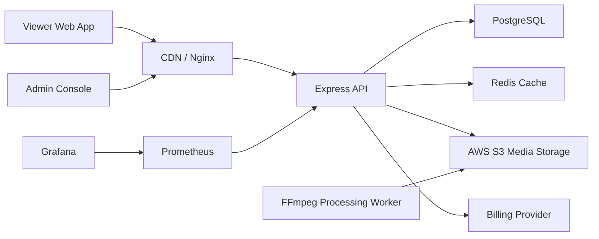

# StreamForge Architecture

StreamForge is a SaaS-grade streaming platform split into frontend, admin, backend, shared packages, Prisma data access, Docker infrastructure, Nginx delivery, Redis caching, PostgreSQL persistence and Prometheus/Grafana monitoring.

## Key Decisions

- React apps are independent Vite workspaces to allow separate deploys for viewer and admin surfaces.
- Express owns authentication, RBAC, subscription state, recommendations, playback authorization and content management.
- Prisma centralizes relational constraints, indexes and query typing.
- Redis caches home rows, search suggestions and recommendation snapshots.
- Video masters are uploaded to S3, transcoded by FFmpeg into HLS and DASH ladders, then delivered through CDN/Nginx.
- Access tokens are short lived. Refresh tokens are stored in HttpOnly cookies and backed by revocable database sessions.
- Admin routes require `ADMIN` or `SUPER_ADMIN`; moderation actions are audited through database timestamps.

## Source Layout

Each deployable React application keeps its startup concerns in `src/app/`:

- `AppProviders.tsx` owns long-lived runtime providers such as React Query and error handling.
- `router.tsx` owns route definitions and code-splitting policy.
- `main.tsx` is only the browser bootstrap seam.

This makes page and shell modules independent of global runtime configuration. The backend follows the same separation at a server level: `app.ts` composes middleware and routes, while `server.ts` owns process startup. Shared packages expose domain types (`shared-types`), UI primitives (`ui`), and pure helpers (`utils`) only.

## Recommendation Formula

`score = genreAffinity * 0.35 + completionRate * 0.25 + ratingAffinity * 0.20 + freshnessBoost * 0.10 + popularityBoost * 0.10`

This balances personal taste, actual watch depth, quality, recency and catalog-wide demand. The function is implemented in `packages/utils/src/index.ts`.
