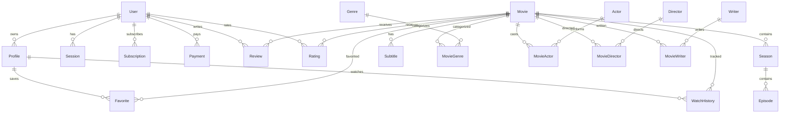

# ERD

```mermaid
erDiagram
  User ||--o{ Profile : owns
  User ||--o{ Session : has
  User ||--o{ Subscription : subscribes
  User ||--o{ Payment : pays
  User ||--o{ Review : writes
  User ||--o{ Rating : rates
  Profile ||--o{ Favorite : saves
  Profile ||--o{ WatchHistory : watches
  Movie ||--o{ Favorite : favorited
  Movie ||--o{ WatchHistory : tracked
  Movie ||--o{ Season : contains
  Season ||--o{ Episode : contains
  Movie ||--o{ Review : receives
  Movie ||--o{ Rating : receives
  Movie ||--o{ Subtitle : has
  Movie ||--o{ MovieGenre : categorized
  Genre ||--o{ MovieGenre : categorizes
  Movie ||--o{ MovieActor : casts
  Actor ||--o{ MovieActor : performs
  Movie ||--o{ MovieDirector : directed
  Director ||--o{ MovieDirector : directs
  Movie ||--o{ MovieWriter : written
  Writer ||--o{ MovieWriter : writes
```
